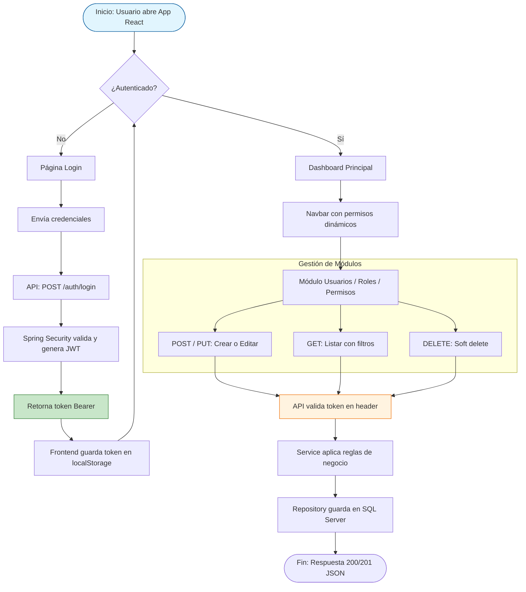

# Diagrama de Flujo del Sistema

Representa el recorrido de un usuario desde el login hasta la gestión de módulos protegidos.

## Flujo Principal

```mermaid
flowchart TD
    A([Inicio: Usuario abre App React]) --> B{¿Autenticado?}
    
    B -- No --> C[Página Login]
    C --> D[Envía credenciales]
    D --> E[API: POST /auth/login]
    E --> F[Spring Security valida y genera JWT]
    F --> G[Retorna token Bearer]
    G --> H[Frontend guarda token en localStorage]
    H --> B
    
    B -- Sí --> I[Dashboard Principal]
    I --> J[Navbar con permisos dinámicos]
    J --> K[Módulo Usuarios / Roles / Permisos]
    
    subgraph CRUD Módulos [Gestión de Módulos]
        K --> L[POST / PUT: Crear o Editar]
        K --> M[GET: Listar con filtros]
        K --> N[DELETE: Soft delete]
    end
    
    L & M & N --> O[API valida token en header]
    O --> P[Service aplica reglas de negocio]
    P --> Q[Repository guarda en SQL Server]
    Q --> R([Fin: Respuesta 200/201 JSON])
    
    style A fill:#e1f5fe,stroke:#01579b
    style G fill:#c8e6c9,stroke:#2e7d32
    style O fill:#fff3e0,stroke:#ef6c00
```
