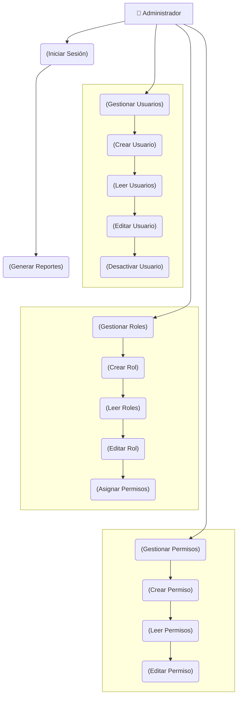

# Diagrama de Casos de Uso

Actores principales: `Administrador del Sistema`.

## Relación entre Actor y Funcionalidades

```mermaid
graph TD
    %% 1. ACTOR PRINCIPAL (Cúspide del diagrama)
    Admin[👤 Administrador]

    %% ==========================================
    %% 2. COLUMNA: AUTENTICACIÓN Y REPORTES
    %% ==========================================
    Admin --> UC_Login("(Iniciar Sesión)")
    UC_Login --> UC_Reportes("(Generar Reportes)")

    %% Enlaces invisibles para forzar que los módulos bajen verticalmente
    UC_Login ~~~ UC_Usuarios
    UC_Reportes ~~~ UC_Roles

    %% ==========================================
    %% 3. COLUMNA / BLOQUE: GESTIÓN DE USUARIOS
    %% ==========================================
    Admin --> UC_Usuarios("(Gestionar Usuarios)")
    
    subgraph Usuarios [" "]
        UC_Usuarios --> UC_C_User("(Crear Usuario)")
        UC_C_User  --> UC_R_User("(Leer Usuarios)")
        UC_R_User  --> UC_U_User("(Editar Usuario)")
        UC_U_User  --> UC_D_User("(Desactivar Usuario)")
    end

    %% Enlace invisible para empujar el siguiente bloque hacia abajo
    UC_D_User ~~~ UC_Roles

    %% ==========================================
    %% 4. COLUMNA / BLOQUE: GESTIÓN DE ROLES
    %% ==========================================
    Admin --> UC_Roles("(Gestionar Roles)")
    
    subgraph Roles [" "]
        UC_Roles  --> UC_C_Rol("(Crear Rol)")
        UC_C_Rol  --> UC_R_Rol("(Leer Roles)")
        UC_R_Rol  --> UC_U_Rol("(Editar Rol)")
        UC_U_Rol  --> UC_A_Perm("(Asignar Permisos)")
    end

    %% Enlace invisible para empujar el siguiente bloque hacia abajo
    UC_A_Perm ~~~ UC_Permisos

    %% ==========================================
    %% 5. COLUMNA / BLOQUE: GESTIÓN DE PERMISOS
    %% ==========================================
    Admin --> UC_Permisos("(Gestionar Permisos)")
    
    subgraph Permisos [" "]
        UC_Permisos --> UC_C_Perm("(Crear Permiso)")
        UC_C_Perm   --> UC_R_Perm("(Leer Permisos)")
        UC_R_Perm   --> UC_U_Perm("(Editar Permiso)")
    end
```
