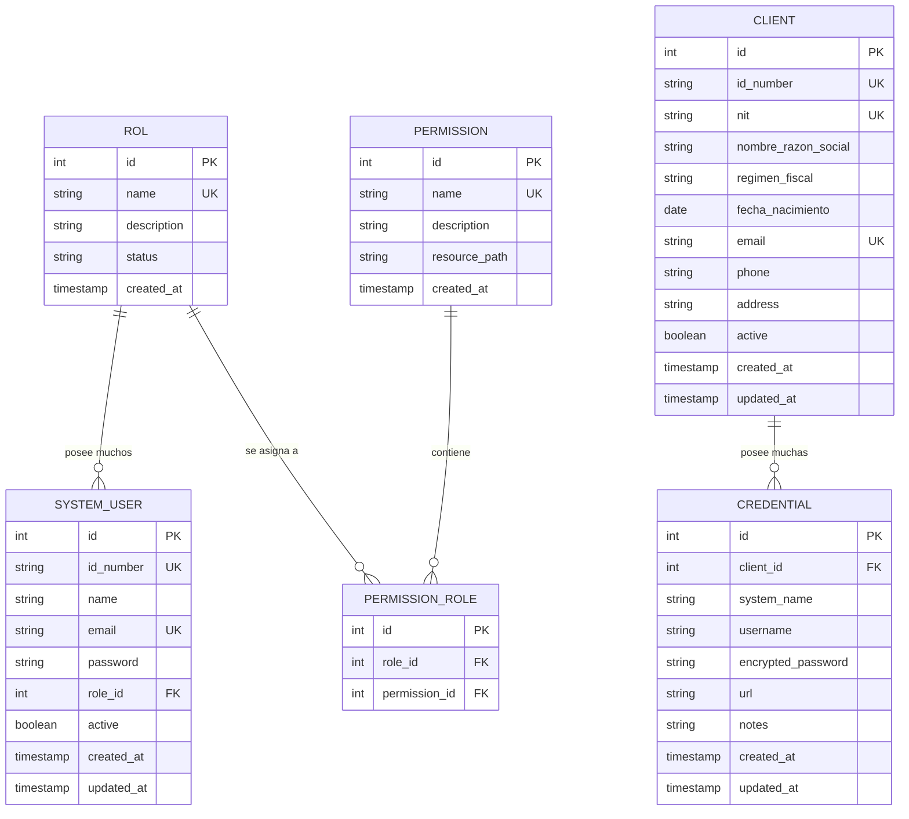

# Modelo Entidad-Relación (ER)

Base de datos relacional. Uso de Hibernate/Spring Data JPA para ORM.
Por defecto SQLite; se puede cambiar a PostgreSQL con el perfil `postgres`.

## Tablas Principales

## Notas
- `SYSTEM_USER` representa los usuarios del sistema (quienes inician sesión).
- `CLIENT` son los clientes gestionados por los usuarios del sistema. Su atributo
  `nombre_razon_social` reemplaza al anterior `name` para alinearse con `DBClientes.sql`;
  `nit`, `regimen_fiscal` y `fecha_nacimiento` también provienen de ese modelo.
- `CREDENTIAL` guarda credenciales de acceso de un cliente a sistemas externos
  (con la contraseña cifrada).
- El borrado de `SYSTEM_USER` y `CLIENT` es lógico (soft delete vía `active`).
