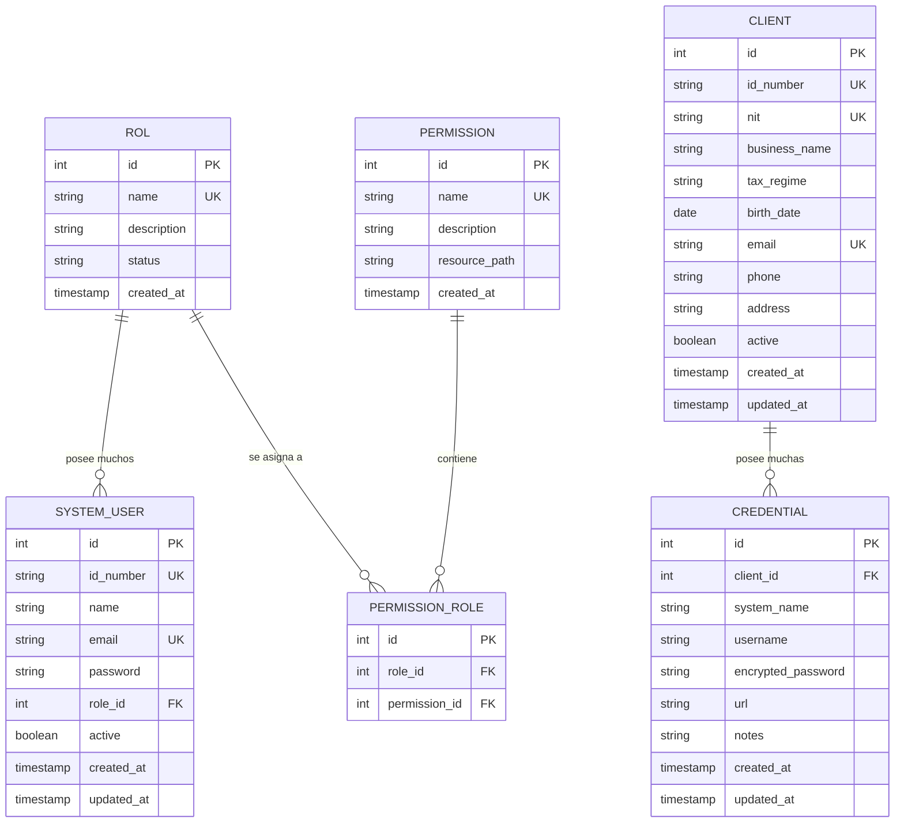

# Modelo Entidad-Relación (ER)

Base de datos relacional. Uso de Hibernate/Spring Data JPA para ORM.
Por defecto SQLite; se puede cambiar a PostgreSQL con el perfil `postgres`.

## Tablas Principales

## Notas
- `SYSTEM_USER` representa los usuarios del sistema (quienes inician sesión).
- `CLIENT` son los clientes gestionados por los usuarios del sistema. Las columnas se
  normalizan en inglés (`business_name`, `tax_regime`, `birth_date`) aunque provienen de
  `DBClientes.sql`, que conserva los nombres en español (`nombre_razon_social`,
  `regimen_fiscal`, `fecha_nacimiento`) como referencia del requisito.
- `CREDENTIAL` guarda credenciales de acceso de un cliente a sistemas externos
  (con la contraseña cifrada).
- El borrado de `SYSTEM_USER` y `CLIENT` es lógico (soft delete vía `active`).
