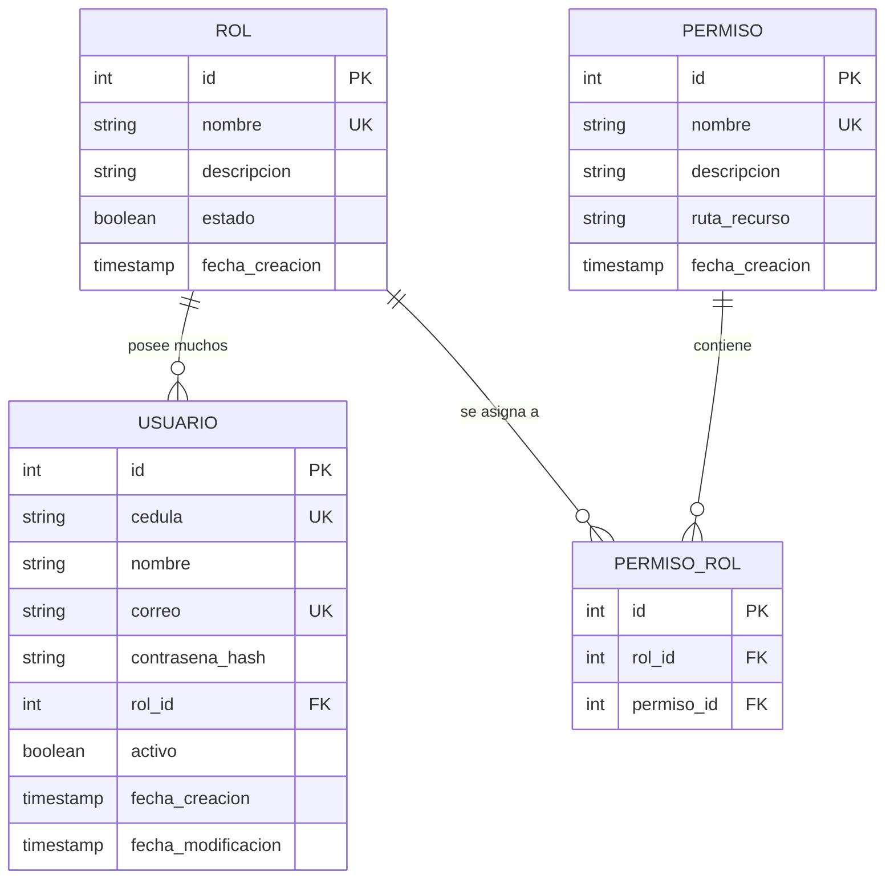

# Modelo Entidad-Relación (ER)

Base de datos relacional con SQL Server. Uso de Hibernate/Spring Data JPA para ORM.

## Tablas Principales

```mermaid
erDiagram
    ROL ||--o{ USUARIO : "posee muchos"
    ROL ||--o{ PERMISO_ROL : "se asigna a"
    PERMISO ||--o{ PERMISO_ROL : "contiene"

    USUARIO {
        int id PK
        string cedula UK
        string nombre
        string correo UK
        string contrasena_hash
        int rol_id FK
        boolean activo
        timestamp fecha_creacion
        timestamp fecha_modificacion
    }

    ROL {
        int id PK
        string nombre UK
        string descripcion
        boolean estado
        timestamp fecha_creacion
    }

    PERMISO {
        int id PK
        string nombre UK
        string descripcion
        string ruta_recurso
        timestamp fecha_creacion
    }

    PERMISO_ROL {
        int id PK
        int rol_id FK
        int permiso_id FK
    }
```
